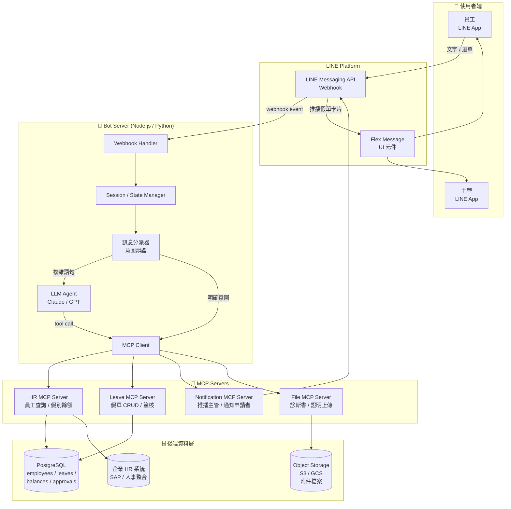
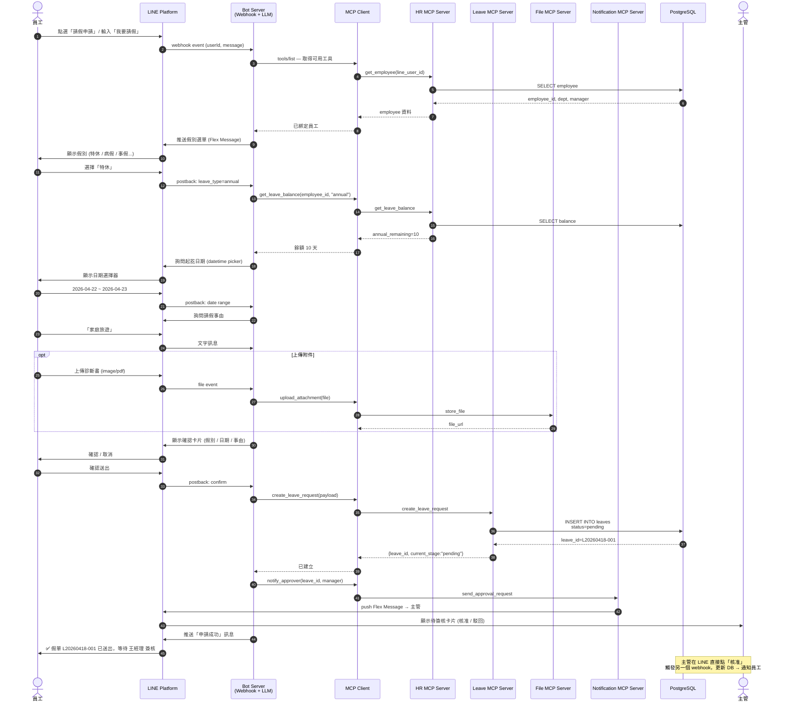
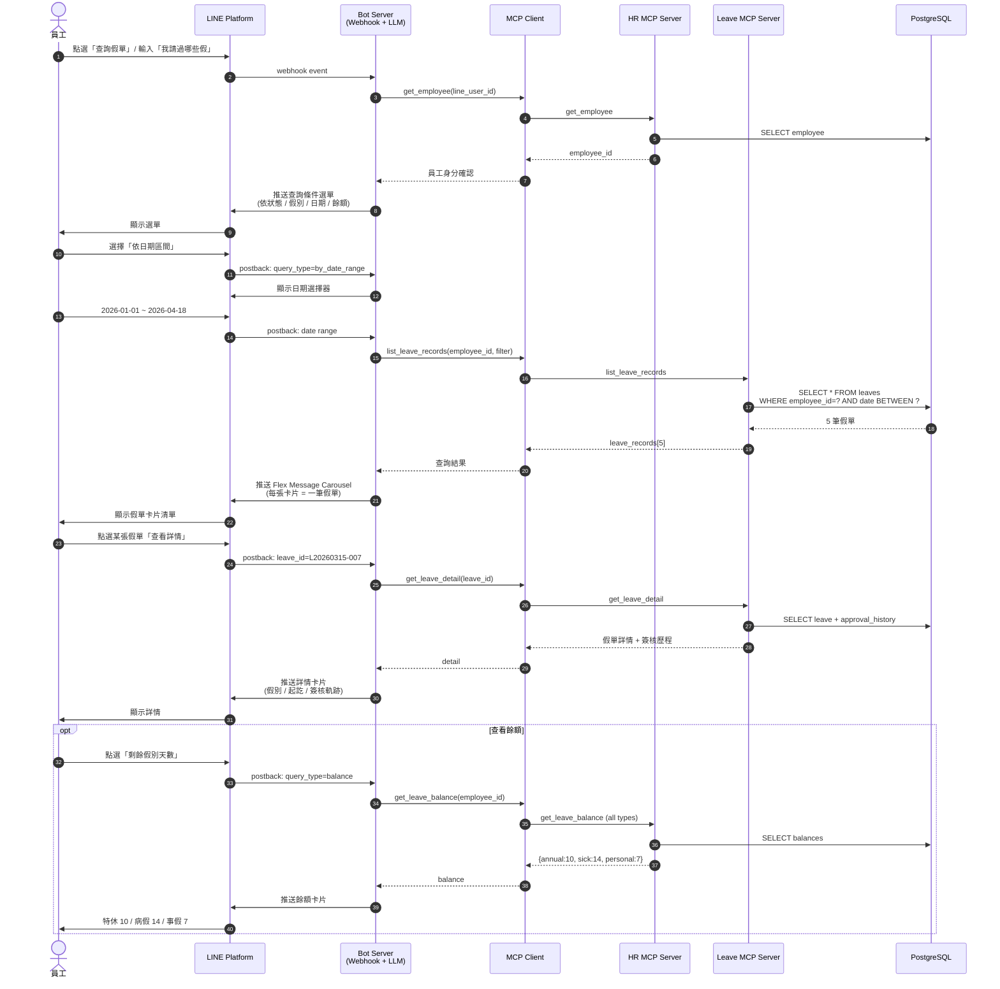

# aipm048 — Line 請假小幫手（MCP 架構設計）

> 透過 LINE 聊天介面提供便捷的請假服務，員工無需登入企業系統即可快速完成請假申請與假單查詢。
> 本專案採用 **MCP (Model Context Protocol) 架構**，讓 LLM 能透過標準化工具介面操作 HR / 假勤 / 通知 / 檔案等子系統。

---

## 系統架構總覽（Flowchart）

---

## 序列圖一：請假申請流程

---

## 序列圖二：查詢假單流程

---

## MCP 工具定義（給 LLM 用）

| MCP Server | Tool Name | 說明 |
|-----------|-----------|------|
| HR | `get_employee` | 由 LINE userId 取得員工資料 |
| HR | `get_leave_balance` | 查詢假別餘額 |
| Leave | `create_leave_request` | 建立假單 |
| Leave | `list_leave_records` | 列出假單（可帶 filter） |
| Leave | `get_leave_detail` | 取得單筆假單詳情 + 簽核軌跡 |
| Leave | `cancel_leave_request` | 取消假單 |
| Leave | `approve_leave` / `reject_leave` | 主管簽核 |
| Notification | `send_approval_request` | 推送待簽核卡片給主管 |
| Notification | `notify_employee` | 通知員工簽核結果 |
| File | `upload_attachment` | 上傳證明文件至 S3/GCS |

---

## 為什麼用 MCP 架構？

1. **可換 LLM**：今天用 Claude，明天換 GPT-5、Gemini，工具介面不變。
2. **HR 系統可獨立替換**：把 HR MCP Server 換成串接 SAP / 人事系統，LINE 端零改動。
3. **可被其他客戶端複用**：同一組 MCP Server 也能被 Claude Desktop、內部後台、Slack Bot 取用。
4. **權限收斂**：所有資料庫存取集中在 MCP Server 層，便於做稽核與 PDPA 合規控制。
